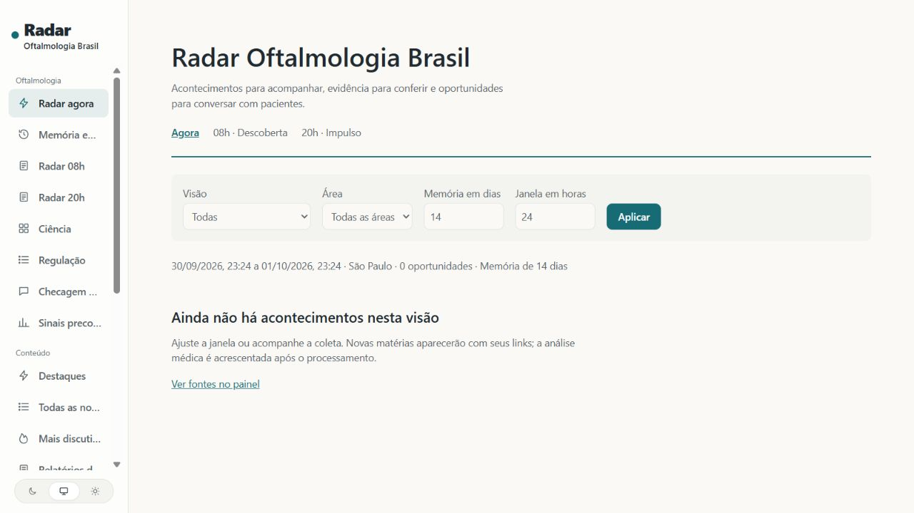
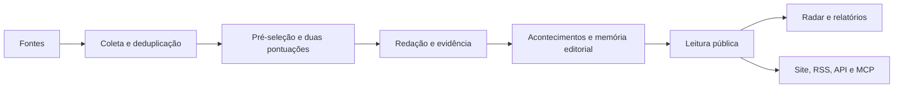

# Radar Oftalmologia Brasil

Plataforma baseada no [AIHOT original](https://github.com/KKKKhazix/AIHOT), especializada em notícias, ciência e oportunidades editoriais de oftalmologia. Preserva coleta, seleção, agrupamento, repercussão, relatórios, administração, RSS, API e MCP, acrescentando fontes médicas, evidência, memória editorial e radar às 08h e 20h de São Paulo.

[Instalação e limites](docs/RADAR-OPHTHALMOLOGY.md) · [Inventário funcional](docs/OPHTHALMOLOGY-DELIVERY.md) · [Personalização](docs/customize.md) · [Implantação](docs/deploy.md)



## Usar a instalação local no Windows

```powershell
ai-hot start
ai-hot status
ai-hot radar ondemand
```

Interface: <http://127.0.0.1:3040/radar>. A instalação deste usuário mantém banco isolado e escuta somente o computador local. Coleta, modelos e descoberta externa começam desativados; configure credenciais e orçamento antes de ativar. Não existe implantação pública automática.

Para usar sua assinatura elegível do ChatGPT Plus/Pro, abra **Modelos e avaliações** no painel e escolha **Continuar com ChatGPT**. Veja o [guia de conexão e limites](docs/CHATGPT.md). A opção por chave de API continua disponível.

## Funcionamento



Um endereço ou conteúdo repetido é armazenado uma vez. A pré-seleção bloqueia materiais claramente alheios ao setor. Duas pontuações independentes são comparadas ao limite da categoria da fonte. Notícias recebem títulos e resumos em português, marcadores e justificativas. Relatos do mesmo fato são agrupados; progressos relacionados permanecem rastreáveis. Agrupamentos incertos passam por revisão de outro modelo; intervenções manuais são preservadas. As instruções e limites ficam públicos em [industry/prompts/](industry/prompts/) e [industry/selection.ts](industry/selection.ts).

Repercussão pertence ao acontecimento: cada fonte independente contribui uma vez na janela de 48 horas, com meia-vida de 24 horas. Dez notícias da mesma fonte não contam como dez fontes. Comparação com seis horas antes indica novidades e crescimento. O radar médico complementa essa atenção com relevância pública, evidência, regulação e histórico editorial; não transforma popularidade em qualidade científica.

## Recursos

| Recurso | Comportamento |
|---|---|
| Fontes | RSS, listas HTML, JSON, X, contas WeChat e ingestão externa; classificação e frequência adaptável |
| Seleção | Pré-seleção, duas notas e limites por fonte; calibração com exemplos no SelectBench |
| Redação | Títulos, resumos com resposta inicial, justificativas, marcadores e tradução integral autorizada |
| Acontecimentos | Agrupamento de relatos, progressos, síntese e preservação de decisões manuais |
| Repercussão | Ranking por fontes independentes, incluindo sinais de discussão no X |
| Relatórios | Diários, semanais e mensais, com seções e introdução; calendário original preservado |
| Temas e busca | Instituições, áreas e formatos; busca em títulos, resumos e conteúdo |
| Integrações | RSS selecionado, geral, integral e diário; API, MCP, Markdown e llms.txt |
| Administração | Fontes, diagnóstico, avaliações, rotas de modelos, orçamento, execução e alertas |
| Módulos originais | Ranking de modelos e monitor de reinícios Codex, configuráveis |
| Oftalmologia | Evidência, fontes primárias, checagem, temas persistentes, descoberta e radar de São Paulo |

## Instalação com Docker

Use Node.js 24 e Docker Compose. Serviços de modelos precisam de uma API compatível com OpenAI.

```sh
git clone https://github.com/brunomed87/AIHOT.git radar-oftalmologia
cd radar-oftalmologia
npm ci
node scripts/init-env.ts --llm-key CHAVE_DO_MODELO
docker compose up -d --build
```

Abra <http://localhost:3000>; o painel fica em /admin e a senha é ADMIN_PASSWORD no .env. Tempo de processamento depende de ativação, fontes e modelos. O exemplo original levou cerca de meia hora para a primeira importação; isso não é garantia desta instalação. Veja [implantação](docs/deploy.md) para HTTPS, atualizações, segurança e custos.

## Adaptar o setor

As principais configurações ficam em industry/: identidade em site.ts, classificação em taxonomy.ts, temas em topics.json, fontes em sources.json, instruções em prompts/, limites em selection.ts, módulos em features.ts e marca e páginas em brand/ e pages/. Use exemplos anotados e scripts/eval-selection.ts para recalibrar seleção; não transplante números sem avaliação.

Agentes de programação podem seguir AGENTS.md e docs/customize.md. A página /agent apresenta MCP, RSS, API e Markdown. /api/v1/agent oferece descoberta; /openapi-v1.json documenta o contrato. Todas as saídas respeitam retirada de conteúdo e permissões de texto integral.

## Documentação

| Documento | Assunto |
|---|---|
| [Personalização](docs/customize.md) | Identidade, classificação, fontes, instruções e marca |
| [Fontes](docs/sources.md) | Seis leitores, classificação, direitos e ingestão |
| [Seleção](docs/selection.md) | Pontuação, exemplos anotados e calibração |
| [Agrupamento](docs/grouping.md) | Relações e avaliação entre reportagens |
| [Implantação](docs/deploy.md) | Docker, HTTPS, atualizações, backups e custos |
| [Arquitetura](docs/architecture.md) | Processos, limites, módulos e interfaces |
| [Módulos de IA](docs/leaderboard.md) | Ranking de modelos e monitor Codex |
| [Oftalmologia](docs/RADAR-OPHTHALMOLOGY.md) | Especialização, operação e limitações |

Tecnologias: Node.js 24, TypeScript, React Router com renderização no servidor, Fastify, PostgreSQL, pg-boss, Tailwind CSS e Docker Compose.

## Origem e contribuições

O autor original, Digital Life Kazik, abriu o framework porque especialistas de outros setores conhecem suas próprias fontes e critérios. Trata-se de uma fotografia de seu site, desenvolvido com auxílio de IA, sem garantia de sincronização de toda atualização futura. O catálogo original inclui dezoito fontes demonstrativas, sem dados operacionais privados. Use nome e marca próprios.

[Questões desta cópia](https://github.com/brunomed87/AIHOT/issues), [contribuições](CONTRIBUTING.md) e [segurança](SECURITY.md). Discussões do framework permanecem na [comunidade original](https://github.com/KKKKhazix/AIHOT/discussions).

Código sob [MIT](LICENSE), com [tradução informativa em português](LICENSE.pt-BR.md). Nome e logotipo AIHOT não estão cobertos como sua marca. Fontes e logotipos de terceiros mantêm seus direitos, detalhados nos [avisos em português](NOTICE.pt-BR.md) e no [NOTICE original](NOTICE). Identificadores de protocolos, nomes próprios, documentos legais originais e exemplos necessários para testar idiomas preservam suas formas canônicas. A [revisão de idioma](docs/LOCALIZACAO.md) descreve o alcance e as verificações.
