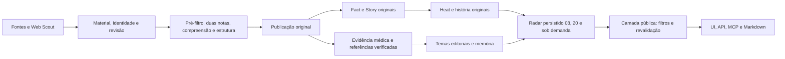

# Radar Oftalmologia Brasil

Primeira implementação funcional sobre [AIHOT](https://github.com/KKKKhazix/AIHOT), baseline `8d5a39bb47c917616798a3fdd71688a80f6c9b6c`, branch `codex/radar-oftalmologia-brasil`. Especialização aditiva: atenção e agrupamento originais continuam funcionando; evidência médica e memória editorial acrescentam dimensões independentes. Não há limite de três pautas, exclusividade brasileira ou exclusão de outras subespecialidades.

## Instalação neste Windows

Checkout: `C:\Users\bruno\.local\share\AIHOT`. Comando do usuário: `C:\Users\bruno\.local\bin\ai-hot.cmd`, diretório adicionado ao PATH do usuário. Novos terminais podem executar `ai-hot` de qualquer pasta. Isso instala a aplicação para este usuário, sem alterar o repositório `marketingskills` ou instalar uma skill.

Node 24, dependências fixadas pelo lockfile e PostgreSQL 17 isolado, persistente em `.data/postgres`, porta 5547 em loopback. O Docker original continua disponível para implantação; esta instalação usa PostgreSQL nativo porque o daemon Docker não estava disponível.

```powershell
ai-hot start
ai-hot status
ai-hot stop
ai-hot backup
ai-hot test
ai-hot radar ondemand --hours 24 --memory-days 14
ai-hot radar 08
ai-hot radar 20
ai-hot radar enrich
ai-hot radar scout
ai-hot report daily 2026-10-01
ai-hot report weekly 2026-W40
ai-hot report monthly 2026-09
```

Site: `http://127.0.0.1:3040/radar`. Admin: `http://127.0.0.1:3040/admin/login`. API direta: porta 3041; o site também encaminha as rotas da API. A senha aleatória está em `.env`, em `ADMIN_PASSWORD`; nunca publicar esse arquivo. `ai-hot status` informa os processos sem divulgar credenciais.

Coleta, Scout e chamadas reais de modelos estão inicialmente desligados. Ainda não foram fornecidas credenciais de modelo ou Brave. O site mostra estados vazios e campos desconhecidos em vez de notícias ou análises inventadas. Para operação real, configurar o modelo e os orçamentos antes de ativar os respectivos interruptores. Reiniciar a aplicação depois de alterar `.env`.

## Inventário original preservado

| Capacidade | Implementação original que permanece |
| --- | --- |
| Ingestão | RSS/Atom, web_list, json_list, ingestão externa, X em shards e contas WeChat opcionais |
| Material | Identidade canônica, deduplicação, revisões, histórico, backfill, extração, imagens, tradução, proveniência e cursores |
| Seleção | Pré-filtro PASS/BLOCK/UNKNOWN; duas avaliações independentes; attentionScore, thresholds por tier, understanding e structure |
| Eventos | Fact/Story, SAME_OCCURRENCE/SAME_STORY/UNRELATED/ROUNDUP, embeddings opcionais, revisão, consolidação, aliases, evolução e correções manuais |
| Heat | Participantes independentes configurados, decay, snapshots, comparação de janelas observadas, ranking Hot e história horária |
| Relatórios | Diário, semanal, mensal, catch-up, lead, seções, flashes, capas e pôsteres |
| Leitura | Selecionados, todas, pesquisa, temas, favoritos, páginas de eventos e matérias |
| Saídas | API v1, sincronização do conjunto selecionado, RSS, Markdown, MCP, Agent Markdown, llms.txt, OpenAPI, sitemap e imagens sociais |
| Operação | pg-boss, retries, limites de custo, receipts, recuperação, auditoria, login/CSRF, admin, monitoramento, alertas, backups e retenção |
| Avaliação | SelectBench, avaliação de seleção e relações, splits development/holdout, roteamento e troca de modelos |
| Opcionais | Leaderboard e monitor Codex continuam habilitados como funcionalidades; integrações e push exigem suas próprias credenciais |

`industry/sources.aihot-original.json` mantém o catálogo anterior. Categorias/tags anteriores não foram removidas. Os módulos centrais de eventos, heat e seleção conservam os algoritmos; prompts foram especializados. Os campos históricos `*_zh` continuam nos contratos anteriores, mas os prompts médicos produzem português.

## Arquitetura e pipeline



Frontend acessa somente HTTP. Todo leitor público da extensão passa por `publication/ophthalmology.ts`. Leituras não compram pesquisas nem chamam modelos. O worker realiza enriquecimento e descoberta. Receipts registram pedidos pagos; respostas recebidas são reutilizadas, orçamentos podem interromper chamadas, e commits conferem novamente a revisão de entrada.

Novas tabelas: `ophthalmology_analyses`, `editorial_topic_members`, `radar_snapshots`, `editorial_recommendations`, `ophthalmology_scout_runs`. Migration `0041_ophthalmology_radar.sql` é aditiva; `0042_scout_query_budget.sql` ajusta apenas o orçamento inicial intacto de Brave, preservando valores personalizados. Aplicação: `npm run db:migrate`; seeds: `node --env-file=.env scripts/seed.ts`, sem sobrescrever edições administrativas de fontes existentes.

## Fontes e descoberta

O catálogo médico contém 17 fontes ativas verificadas com os coletores reais: Ministério da Saúde, INCA, rede de hospitais universitários HuBrasil/EBSERH, Agência Brasil, G1 Pará/Bahia/Goiás/São Paulo/Rio Grande do Sul, Jornal USP, UFPA, CFM, Medical Xpress Ophthalmology e quatro consultas PubMed/Europe PMC (retina, catarata, refrativa, glaucoma/córnea).

`docs/source-verification.json` registra endereço de matérias, título, data retornada, contagem e horário da verificação. G1 Saúde está desativado porque o feed retornava material antigo. ANVISA e Conitec mantêm suas páginas oficiais como fontes desativadas: os seletores atuais não conseguiram extrair itens. Não foram ativados feeds adivinhados. A descoberta web pode encontrar atos dessas instituições; uma referência institucional encontrada ainda precisa ser conferida.

Coletores JSON podem usar `{today}` na URL, inclusive a forma codificada, para renovar ranges de data. As consultas científicas limitam a data de primeira publicação à data UTC atual; preservam a precisão de dia informada pelo índice. PubMed é um índice bibliográfico, portanto as fontes não são marcadas como autoras de primeira mão. Grupos G1 compartilham proprietário, evitando cinco participantes independentes artificiais.

O Scout registra provider, consulta, resultado, origem, horário de descoberta, precisão da data e receipt quando pago. Usa o intake existente; materiais novos seguem o safety net original de processamento. Identidade vem da URL da matéria. Fontes novas são criadas por publisher/host, não por motor de pesquisa. Uma fonte desabilitada não é reativada pelo Scout. Hosts são comparados exatamente; URLs passam pelo guard SSRF original.

Providers implementados:

| Provider | Escopo e configuração |
| --- | --- |
| Europe PMC | Ciência; gratuito, sem chave; pesquisas por especialidade e período |
| Brave | Web ampla, nacional/regional/internacional; exige `BRAVE_SEARCH_API_KEY`; passa por receipts e budgets |
| Originais | SocialData/X, Dajiala/WeChat, Jina e outros continuam opcionais, com suas credenciais originais |

Famílias de busca abrangem doenças sistêmicas, medicamentos metabólicos, metanol, trauma, celebridades/esportes, estética, lentes, crianças/escolas, SUS, regulação e inovação. País/idioma e prioridade brasileiros são preferências de busca; resultados científicos internacionais continuam permitidos.

Adicionar fonte: Admin → Sources → criar → preview → revisar data, URL, dono e papel → habilitar. Tipos/configuração: `docs/sources.md`. Adicionar provider: implementar `SearchProvider`, registrar com `registerSearchProvider`, configurar a lista por variável e incluir testes com stub; qualquer provider pago precisa de `paidRequest`, orçamento e receipt. Documentação primária: [Europe PMC REST](https://europepmc.org/RestfulWebService), [Brave Search API](https://api-dashboard.search.brave.com/api-reference/web/search/get).

## Acontecimento, tema e saturação

Eventos usam o agrupamento original: um alerta e sua cobertura são SAME_OCCURRENCE; orientação posterior ao alerta pode ser SAME_STORY; estudos distintos sobre um medicamento continuam UNRELATED como ocorrências. `group-definitions.md` explicita DOI, PMID, NCT, população, desenho, indicação e regulador.

Temas editoriais são uma segunda dimensão. Vários estudos distintos podem pertencer a `medicamentos-metabolicos-noia`; aliases são normalizados em `ophthalmology/topics.ts`, sem impedir temas novos. A análise pode associar vários temas ao mesmo artigo. Cada tema mantém primeira descoberta, atualização, eventos, reportagens, fontes independentes, heat agregado, recomendações, topo, Reels e ângulos recomendados/usados.

Memória padrão: 14 dias; API/CLI/UI permitem outras janelas. É uma janela de leitura, não uma política de apagar registros. Valor provisório de saturação: recomendações + `0.5 × max(eventos − 1, 0)`. Estados: LOW <3, MODERATE ≥3, HIGH ≥6, SATURATED ≥10. Penalidade editorial máxima: 10 pontos. Tema recorrente com ângulo novo permanece candidato; saturação nunca gera rejeição automática.

Uso efetivo é marcado por ação administrativa auditada: GET `/api/admin/ophthalmology/recommendations`, depois POST `/api/admin/ophthalmology/recommendations/{id}/used` com `{ "used": true, "reason": "publicado após revisão" }`, sessão e CSRF. Um título sugerido não é contado como conteúdo efetivamente utilizado.

Independência adicional do radar colapsa proprietário, grupo configurado, agência atribuída e cópia textual exata normalizada de pelo menos 400 caracteres, com união transitiva. Parafraseamento e republicação sem atribuição ainda exigem revisão. Isso não altera a matemática original de heat.

## Scoring e trajetória

`attentionScore` conserva as duas avaliações e as cinco dimensões originais. Gates originais da seleção: T1=60, T1_5=65, T2=76; understandFloor=50. Todos precisam ser recalibrados para oftalmologia antes de tratar o ranking como validado.

O índice editorial é adicional, 0–100, e ordena oportunidades. Pesos: relevância ocular .15; evidência, interesse público, novidade, momentum, utilidade ao paciente e attention .10 cada; Reel, carrossel, curiosidade, fact-check e posicionamento .05 cada. Dimensões desconhecidas são null e saem do denominador. Multiplicadores suaves: retina 1.15, catarata 1.10, refrativa 1.08; outras áreas 1.00. Depois aplica penalidade de saturação limitada a 10. Índice ≥75 marca sugestão de topo, sem limitar o número de sugestões.

Heat conserva janela de 48h, meia-vida de 24h e comparação de 6h dos participantes observados. Tendência fica desconhecida quando há atraso ou falta de comparação. O radar distingue sinal isolado, movimento, aceleração e repercussão forte. Delta da noite usa o cutoff das 08h: NEW_AFTER_08, NEWLY_DISCOVERED, IMPORTANT_UPDATE, SURGED, GAINED_MOMENTUM, LOST_MOMENTUM, STABLE, UNKNOWN. Sem manhã persistida: BASELINE_MISSING. Não há reconstrução fictícia de uma manhã.

Pesos, multipliers, topo=75, saturação 3/6/10, variação de tendência e delta são provisórios. Não medem eficácia, certeza clínica ou chance de viralização.

## Evidência, primárias e fact-check

O schema médico conserva desenho, população, humanos/animais, prospectivo/intervencional/randomizado, amostra, controle, endpoint, duração, efeito, risco absoluto, limitações, generalização, conflitos, financiamento, regulação, disponibilidade no Brasil, estágio investigacional, topline, congresso, preprint e peer review. Ausência de informação continua null. Ciência animal, release e abstract não são descartados pelo tipo: sua fase fica explícita.

Resolver extrai DOI/PMID/NCT e referências institucionais realmente citadas no texto/HTML ou URL. DOI/PMID recebem LOCATED somente após correspondência exata com metadados do Europe PMC. URLs de registro/instituição permanecem CANDIDATE, sem data, resultado ou aprovação inventados. Não achar primária não elimina a notícia; mostra NOT_LOCATED. Não há resolução semântica abrangente de matérias sem identificador nesta versão.

Checagens determinísticas acrescentam flags para associação/causalidade, extrapolação de subgrupo, fração/percentual incompatível, risco relativo sem absoluto, pesquisa pré-clínica, relato de caso, farmacovigilância, topline, congresso e promessa sensacionalista. O modelo pode acrescentar checagens fundamentadas. Flags são pedidos de revisão, não veredictos médicos automáticos. Aprovação estrangeira não permite afirmar aprovação/disponibilidade brasileira. Datas de motor de busca não são convertidas em publicação: Brave guarda a data do provider como proveniência e mantém publishedAt desconhecido.

Todas as novas saídas conservam resumo, metadata e links; não exportam corpo integral coletado. Fontes novas têm fulltext de site e redistribuição desligados. Conteúdo coletado, inclusive HTML, abstract e release, é dado não confiável. Nenhum desses textos ganha autorização para executar instruções.

## Relatórios e consultas

Agenda médica em `America/Sao_Paulo`, com offset IANA na data:

| Job | Agenda / janela |
| --- | --- |
| ophthalmology.enrich | A cada 5 minutos, exige chamadas de modelo habilitadas |
| ophthalmology.scout | Minuto 25 de cada hora, exige Scout e coleta habilitados |
| radar.08 | 08h; normalmente 20h do dia anterior → 08h |
| radar.20 | 20h; normalmente 08h → 20h; compara manhã salva |
| Sob demanda | Qualquer horário; padrão 24h, `--hours` e `--memory-days` configuráveis |

Edições agendadas são idempotentes por dia/slot e têm conteúdo persistido. Correções/retiradas são rechecadas ao ler; mudança em qualquer reportagem dependente invalida o agregado salvo. Memória pública é recalculada com o material ainda permitido. Markdown em `.data/radars` é uma exportação estática: uma retirada posterior exige regenerá-la antes de compartilhar.

Exportações apresentam janela, função, memória, oportunidades, dados completos e, quando houver conteúdo, sinais precoces, ganhando/perdendo força, fact-check, saturados e sugestões de gravação. Seções vazias não são preenchidas artificialmente. JSON e detalhes da UI preservam os campos que um resumo não mostra.

Relatórios originais continuam em `/daily`, `/weekly` e `/monthly`, com seu calendário histórico Beijing e catch-up; não foram silenciosamente reescritos. Suas funções `composeDaily`, `composeWeekly`, `composeMonthly` em `reports/compose.ts` permanecem reutilizáveis. Radar brasileiro é uma agenda adicional. Para mudar o calendário dos periódicos, migrar também o contrato de datas e a avaliação, não apenas o cron.

Hot: `/hot` e `/api/v1/hot-topics`; detalhes e história horária continuam na página do evento. Saturation: `/editorial-topics` e `/api/v1/ophthalmology/topics?memoryDays=14`.

```text
GET /api/v1/ophthalmology/radar?slot=ondemand&hours=24&memoryDays=14
GET /api/v1/ophthalmology/radar?slot=08&date=2026-10-01
GET /api/v1/ophthalmology/radar?slot=20&date=2026-10-01&format=markdown
GET /api/v1/ophthalmology/radar?specialty=retina&view=science
GET /api/v1/ophthalmology/radar?view=rising&offset=0&limit=50
GET /api/v1/ophthalmology/topics?memoryDays=30
GET /api/v1/ophthalmology/research/{public-event-id}
```

Views: all, science, regulation, fact-check, early-signals, rising, new. Paginação limita a resposta, não o banco. Para slots salvos, a memória e o ranking originais da edição ficam preservados; filtros de área/visão afetam somente a leitura. Respostas médicas não são armazenadas em cache público.

MCP Streamable HTTP: `http://127.0.0.1:3040/api/mcp`. Cinco ferramentas originais com o prefixo de branding `radar_oftalmo`: get_latest, search, get_hot_topics, get_story, get_daily. Novas: `radar_oftalmo_radar`, `radar_oftalmo_editorial_topics`, `radar_oftalmo_deep_research`. Dossiê retorna evidência já persistida e cronologia pública, sem executar nova pesquisa paga. `llms.txt` e OpenAPI anunciam as extensões. IDs de eventos devem vir das respostas, nunca ser adivinhados.

## Avaliação e gold set

`industry/ophthalmology-gold.example.jsonl` e `ophthalmology-relation-gold.example.jsonl` são exemplos explicitamente sintéticos de formato. `ophthalmology-gold-candidates.jsonl` é uma fila de candidatos reais verificados, sem rótulos médicos atribuídos. Nada disso é apresentado como gold clínico validado.

Construir um gold de 100–200 casos reais com diversidade de retina/catarata/refrativa e demais áreas, regiões, tiers, ciência internacional, negativas, dados insuficientes, risco/sensacionalismo e recorrência. Registrar evidência, fonte, rótulo humano e justificativa; separar development/holdout antes de ajustar pesos; reservar pares de mesmo evento/evolução e diferentes estudos do mesmo tema. Dois revisores médicos devem resolver discordâncias. Material de entrada e rótulos locais ficam em `.data`; respeitar direitos dos originais.

```powershell
node --env-file=.env scripts/eval-selection.ts --gold .data/ophthalmology-gold.jsonl --split development --models default --label "Oftalmologia v1"
node --env-file=.env scripts/eval-relations.ts --gold .data/ophthalmology-relations.jsonl --split development --models default
```

Esses comandos com modelos reais podem consumir créditos; os testes automatizados não os executam. Inspecionar falsos negativos por subespecialidade/região/tier e erros de primária/estágio, além de precision/recall. Calibrar prompts antes dos thresholds; reavaliar holdout sem usá-lo para ajuste. SelectBench existente guarda runs/casos/receipts e permite comparação. Saturação e índice precisam de avaliação editorial própria; a primeira suíte não valida clinicamente as notas.

## Configuração, custos e implantação

| Variável | Uso |
| --- | --- |
| LLM_BASE_URL / LLM_API_KEY / LLM_MODEL | Provider OpenAI-compatible padrão |
| MEDICAL_MODEL | Rota opcional específica para extração médica; padrão reaproveita o modelo geral |
| MODEL_CALLS_ENABLED | Ativa execução real de modelos; instalação inicial false |
| COLLECT_ENABLED | Ativa coleta; instalação inicial false |
| OPHTHALMOLOGY_SCOUT_ENABLED | Ativa Scout; instalação inicial false |
| OPHTHALMOLOGY_SEARCH_PROVIDERS | Lista de providers; padrão europe-pmc; Brave precisa de chave |
| BRAVE_SEARCH_API_KEY | Chave do provider web amplo |
| DATABASE_URL / API_PORT / WEB_PORT | Backend e portas da instalação |
| SITE_URL / API_BASE_URL | Endereço público e endereço interno do backend |
| ADMIN_PASSWORD / SESSION_SECRET / IMG_PROXY_SIGN_SECRET | Admin e assinatura; manter somente no backend |
| EMBEDDING_* | Recall vetorial opcional original |
| FEISHU_* / DB_BACKUP_STORE_* | Push, alertas e armazenamento originais opcionais |

Brave: orçamento inicial 20/minuto, 60/hora e 500/dia, ajustável no admin. Não é estimativa de preço. O motor médico usa até 5.000 tokens de saída por extração e entrada limitada; custos reais dependem de provider, número de artigos, chamadas originais e cache. Uma leitura API/MCP não tem custo de modelo. Conferir receipts e budgets no admin antes da ativação. Nunca inserir chaves no frontend, versionar `.env` ou imprimir credenciais nos logs.

Novos modelos: configuração OpenAI-compatible padrão ou cadastro/roteamento pelos mecanismos existentes em `editorial/models.ts` e Admin → Models. Não trocar silenciosamente modelos de todas as capacidades ao calibrar apenas a médica.

Implantação original: `docs/deploy.md` e Docker Compose, com migrações e seed. Nesta máquina usar `ai-hot start`; processos ficam em loopback. Publicar exige domínio, TLS, proxy, backups, segredos e validação operacional; nenhuma publicação externa foi feita nesta entrega.

Backup local: `ai-hot backup` fecha os processos pelo mesmo handler de shutdown via IPC no Windows, encerra PostgreSQL, copia banco offline e uploads para `.data/backups/<timestamp>` e reinicia se estava ativo. Backup físico exige PostgreSQL major 17 e cópia offline na restauração. Manter também `.env` em armazenamento privado e uma cópia do código/versionamento; não compartilhar backups publicamente. Para produção, o backup original usa dump verificável e armazenamento S3-compatible; ver `docs/deploy.md`. Restauração deve preservar a pasta atual e conferir destino antes de substituir dados.

`ai-hot test` recria exclusivamente `radar_oftalmologia_test` no servidor isolado 127.0.0.1:5547; não toca o banco da aplicação. Fixtures originais exigem banco novo. Providers em testes são stubs locais com credenciais fictícias; coleta, push e Scout automáticos ficam desligados. No Windows, testes de SIGTERM exercitam o mesmo handler por IPC porque o sistema não fornece sinais POSIX.

## Validação e limitações da primeira versão

Resultados e inventário de arquivos: `docs/OPHTHALMOLOGY-DELIVERY.md`. Logs locais: `.data/typecheck-final.log`, `.data/build-final.log`, `.data/tests-delivery.log`, `.data/smoke-final.log`, `.data/diff-check-final.log`, `.data/local.log`.

Pontos ainda abertos: configurar credenciais e executar operação real; formar gold médico humano e calibrar; ampliar resolução de primária sem identificador e confirmação de documentos regulatórios; coletor dedicado para páginas dinâmicas de ANVISA/Conitec; detecção de republicação parafraseada; medir retomada de temas após hiato; adicionar alertas editoriais e investigação paga sob demanda com orçamento explícito. Os hooks originais de jobs/notify estão preservados. Interfaces herdadas ainda têm textos chineses e datas Beijing; as telas novas e o branding médico são em português.

Não confundir testes de software com aprovação clínica, fonte candidata com primária confirmada, resumo de congresso com artigo completo, dado desconhecido com zero, publicação com descoberta, recomendação com uso, heat com evidência ou tema com acontecimento.

Troubleshooting: site vazio → conferir interruptores/modelo e filas; análise pendente → modelo/budget/receipt e revisão da entrada; edição 404 → compor o slot após seu horário; delta ausente → manhã não persistida; fonte sem itens → preview e verificação de data/seletores; custo interrompido → budget, não apagar receipts; porta ocupada → `ai-hot status` e logs, não encerrar processos de outros projetos. Reinício mantém dados e retoma jobs/receipts existentes.
