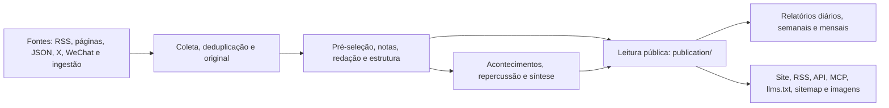

# Arquitetura



## Processos

| Processo | Local | Responsabilidade |
|---|---|---|
| api | apps/api/ | Fastify; interfaces internas /api/site/, públicas /api/v1/, RSS, MCP, administração, imagens e cartões |
| worker | apps/worker/ | pg-boss; coleta, modelos, agrupamento, repercussão, relatórios, alertas e limpeza |
| web | apps/web/ | React Router no servidor; acessa api por HTTP, sem banco direto |

Regras de negócio em packages/backend/, tipos e constantes em packages/contracts/ e configuração do setor em industry/. A especialização médica adiciona os módulos documentados em [RADAR-OPHTHALMOLOGY.md](RADAR-OPHTHALMOLOGY.md).

## Regras de funcionamento

- Uma leitura pública: publication/ serve site, RSS, API, MCP, sitemap e cartões. scope.ts centraliza visibilidade, atraso e evidência; novas saídas respeitam retiradas e licença integral.
- Páginas leem resultados existentes. Modelos só executam em tarefas do worker.
- Requisições pagas de modelo, X, WeChat e Jina usam recibos; resultados são armazenados antes do uso e reutilizados após reinícios. Recibo incerto pode ser liberado automaticamente uma vez após trinta minutos, reenfileirando extração ou análise. Segunda incerteza exige conferência administrativa em Execução.
- Orçamentos por minuto, hora e dia interrompem cada serviço ao atingir limite; ajuste em Configurações.
- COLLECT_ENABLED, MODEL_CALLS_ENABLED, FEISHU_CONTENT_PUSH_ENABLED, FEISHU_INTERNAL_ENABLED e INDEXNOW_SUBMIT_ENABLED controlam saídas reais, sem trocar regras de negócio. Desative no desenvolvimento e nos testes.
- Conteúdo público anônimo é igual para administradores e visitantes. Favoritos e leituras ficam no navegador; painel exige administração.
- Materiais descobertos com mais de 48 horas, primeiras importações e ingestões históricas são arquivados na data original, sem aparecer como novidade ou gerar envio.
- Cada seleção liga ao original. site_fulltext controla exibição integral, desativada por padrão.
- Administração chama módulos de conteúdo, acontecimentos, notificações e recuperação sem reescrever estados diretamente. Módulos não dependem da administração. Mudança manual, resultado público e recuperação são registrados juntos.
- Interfaces administrativas seguem packages/contracts/src/admin.ts; tarefas seguem JobData de jobs/queue.ts. Emissor e receptor são verificados juntos.

Esses limites são verificados por tests/architecture.test.ts. Ao mudá-los, atualize documentação e verificações. Preserve configurabilidade de industry/, sem substituí-la por parâmetros fixos de uma instalação.

## Diretórios

| Local | Conteúdo |
|---|---|
| industry/ | Identidade, categorias, fontes, instruções, limites, marca e páginas |
| packages/backend/src/sources/ | Seis leitores e agenda collect.ts |
| packages/backend/src/content/ | Armazenamento, deduplicação, extração e limpeza |
| packages/backend/src/editorial/ | analyze.ts, prompts.ts e rotas de models.ts |
| packages/backend/src/events/ | Agrupamento, repercussão e síntese |
| packages/backend/src/publication/ | Leitura pública |
| packages/backend/src/reports/ | Relatórios periódicos |
| packages/backend/src/providers/ | Modelos, vetores, X, WeChat, Jina, recibos e orçamento |
| packages/backend/src/notify/ | Notificações Feishu |
| packages/backend/src/operations/ | Alertas, backup, limpeza e IndexNow |
| packages/backend/src/admin/ | Administração |
| packages/backend/src/leaderboard/ e monitor/ | Ranking e monitor Codex |
| apps/web/app/routes/ | Páginas e tabela routes.ts |
| database/migrations/ | Migrações numéricas |
| scripts/ | Instalação, migrações, dados iniciais, avaliação e verificação |
| tests/ | Backend, com banco vazio terminado em _test ou _ci |

## Saídas públicas

| Endereço | Conteúdo |
|---|---|
| /, /all, /hot, /topics, /daily, /weekly, /monthly | Seleção, notícias, repercussão, temas e relatórios |
| /radar e /editorial-topics | Radar médico e memória editorial |
| /feed.xml, /feed/all.xml, /feed/full.xml, /feed/daily.xml | RSS selecionado, geral, integral e diário |
| /api/v1/ | API; contrato /openapi-v1.json e orientações /agent |
| /api/mcp | MCP; prefixo em industry/site.ts |
| /llms.txt, /sitemap.xml, /robots.txt | Descoberta para agentes e buscadores |
| /admin | Administração |

## Verificações

```sh
npm run typecheck
createdb myhot_test
DATABASE_URL=postgres://127.0.0.1:5432/myhot_test node scripts/migrate.ts
DATABASE_URL=postgres://127.0.0.1:5432/myhot_test npm test
npm run build -w @aihot/web
node --test apps/web/tests/*.test.ts
```

Testes substituem modelos e interfaces pagas por serviços locais; não acessam fornecedores externos.
